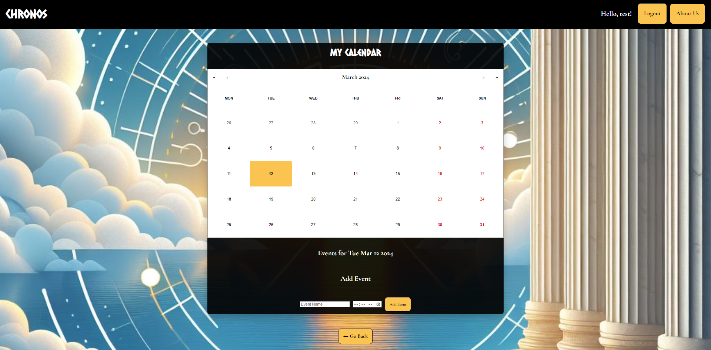

# Chronos

## Description

Chronos is a simple calendar app designed for creating, planning, and tracking events.

## Installation

N/A

## Usage

To use the app, please visit this link: [Link]. 

From there, you must use the sign up button to create an account, or log in if you already have one. After that, you can click the "View Calendar" button to be taken to your calendar. 

Once on your calendar page, you can select the date, month, and year from the date picker, then use the "Add Event" form at the bottom to add a new event to that selected date. Once the event has been added, it will be saved to your calendar for future reference. You can click the "Delete Event" button to remove the event.

## Credits

Vite, LogRocket, W3 Schools, MDN Web Docs, Stack Overflow, with special thanks to our instructors John and Mary!

## License

Please refer to the LICENSE in the repo.